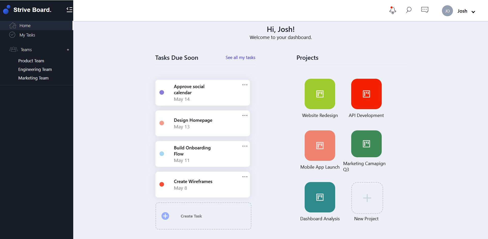
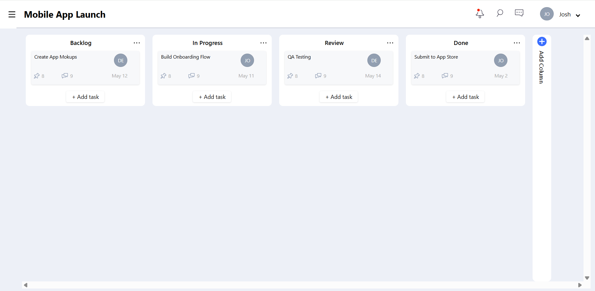
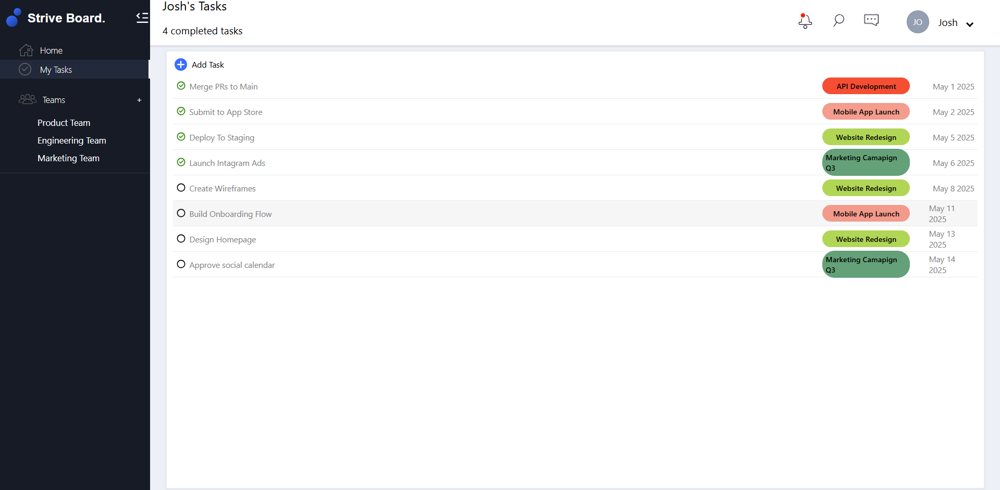
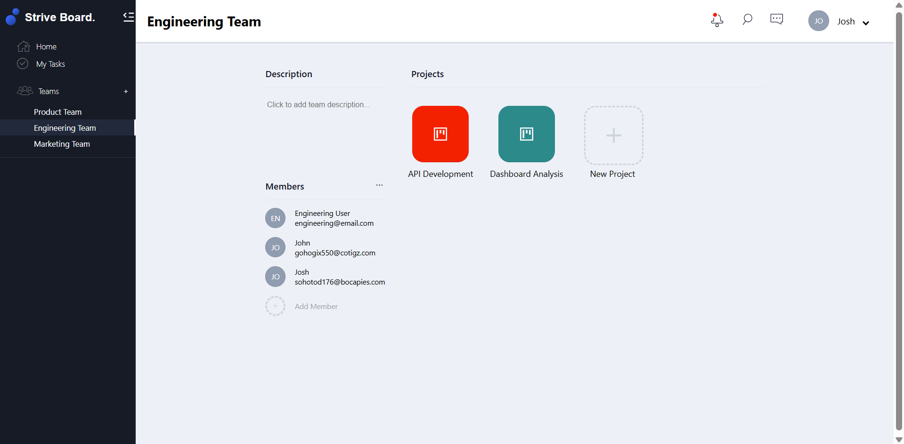

# <h1 align="center">Srive Board: Team Task Manager</h1>

**A full-stack collaborative project and task management tool built for teams to streamline workflows using Kanban-style boards.**

 

---

## Project Description

**Strive Board** is a collaborative full stack web-based project management tool designed to help teams organize tasks, streamline workflows, and boost productivity. It combines the power of a Kanban-style task board with team-based role management, allowing users to create projects, assign tasks, set priorities, and track real-time progress—all from an intuitive dashboard. 

---

## Table of Contents
- [Project Title and Overview](#project-title-and-overview)
- [Project Description](#project-description)
- [Features](#features)
- [Technology Stack](#technology-stack)
- [Demo](#demo)
- [Installation](#installation)
- [Usage](#usage)
- [Testing](#testing)
- [License](#license)
- [FAQs](#faqs)
- [Contact Information](#contact-information)

---

## Features

- 🧑‍🤝‍🧑 Users can **create teams** and add multiple members to collaborate.
- 🗂️ **Create multiple projects** within each team to keep tasks organized.
- ✅ **Assign tasks** to specific team members and monitor progress.
- ✔️ **Mark tasks as completed** using a simple and intuitive task list interface.
- 🔐 **User authentication** with encrypted passwords using BcryptJS to ensure secure access.
- 🎭 **Role-based access**: Create and manage teams with different roles (e.g., admin, member) for controlled access.
- 🛠️ **Drag-and-drop Kanban boards** to organize tasks under each project, making task management smooth and visual.
- 📅 **Task management**: Assign deadlines, set priorities, and track task statuses for better workflow visibility.

---
## Technology Stack

**Frontend**:
- React.js – Component-based UI library
- Material UI – Pre-built React UI components
- React Hook Form – Lightweight form handling
- Axios – Promise-based HTTP client
- React Hooks – Reusable functional logic

**Backend**:
- Node.js – JavaScript runtime
- Express – Web framework for building REST APIs
- Sequelize ORM – ORM for PostgreSQL
- PostgreSQL – Relational database
- JWT (JSON Web Token) – For secure user authentication
- BcryptJS – Password hashing for secure user authentication
- RESTful APIs – Architecture style for APIs to enable communication between client and server

**Other Tools**:
- Postman – API testing tool
- Git/GitHub – Version control and collaboration platform for source code management

---
## Demo

Below are snapshots showcasing the core features and UI of the **Strive Board** application, demonstrating its functionality and user interface in action:

- 📊 **Dashboard**: View an overview of your team's activity, ongoing projects, and tasks.

  

- 📁 **Project Board**: Manage and track progress for each project with a visually intuitive interface.

  

- 📋 **Task List**: Easily assign and manage tasks, check off completed ones, and track progress.

  

- 👥 **Teams UI**: Create and manage teams, assign roles, and collaborate effectively.

  

---

## Installation

Follow the steps below to run the project locally:

### 1. Clone the Repository

- Clone the repository and navigate to the project folder:

   ```bash
   git clone https://github.com/ThakkarVidhi/team-task-manager.git  
   cd team-task-manager
   ```

### 2. Set Up the Backend

- Navigate to the backend folder and install dependencies:

   ```bash
   cd server  
   npm install
   ```

- Configure environment variables:  

   Create a `.env` file inside the `server` directory with the following variables:
   
   ```.env
   SERVER_PORT=<your_server_port>
   PORT=<your_postgres_port>
   DB_USERNAME=<your_database_username>
   DB_PASSWORD=<your_database_password>
   DB_DATABASE=<your_database_name>
   DB_HOST=<your_database_host>
   JWT_SECRET=<your_jwt_secret>
   JWT_EXPIRES_IN=<jwt_expiration_time_in_seconds>
   ```

- Set up the database:

   ```bash
  npx dotenv sequelize db:migrate:undo:all  
  npx dotenv sequelize db:migrate  
  npx dotenv sequelize db:seed:all
   ```

- Start the backend server:

   ```bash
  npm run dev
   ```

### 3. Set Up the Frontend

- Navigate to the frontend directory and install dependencies:

   ```bash
  cd ../client  
  npm install
   ```

- Create a `.env` file inside the `client` directory with the following:

   ```.env
   REACT_APP_NODE_ENV=<development/prodcution>
   ```

- Start the frontend development server:

   ```bash
  npm start
   ```

### 4. View the Application

- Open your browser and visit:

   ```bash
  http://localhost:3000
   ```

---

## Usage

After running both servers:

- Register or log in.
- Create a team.
- Add users to a team.
- Create projects under that team.
- Assign tasks to members.
- Track and mark tasks as completed.

---

## Testing

You can manually test the application by running both the backend and frontend servers locally and interacting with the UI.

Basic testing using Postman:

```bash
POST /api/auth/register
POST /api/teams
POST /api/projects
POST /api/tasks
GET  /api/teams/:id
```


> 🛠️ There’s much more to explore — feel free to check out the codebase for additional APIs, middleware, error handling, and business logic across the backend services.

---

## License

This project is licensed under the [MIT License](LICENSE).  


---

## FAQs

**Q: What is Strive Board?**  
**A:** Strive Board is a full-stack team collaboration and task management application. It allows users to manage teams, projects, and tasks with features like Kanban boards, role-based access, and progress tracking.

**Q: Who is Strive Board built for?**  
**A:** It’s designed for teams of all sizes—startups, student groups, or organizations—looking to collaborate, assign tasks, and track progress in a centralized platform.

**Q: How does user authentication work?**  
**A:** Strive Board uses JWT (JSON Web Tokens) for session-based authentication, and passwords are securely hashed using Bcrypt.

**Q: What kind of roles can users have?**  
**A:** Users can be assigned roles such as **admin** (with full permissions) or **member** (limited to assigned actions) within each team.

**Q: Is there drag-and-drop task management?**  
**A:** Yes! Strive Board supports Kanban-style task boards with drag-and-drop functionality to easily update task statuses.

**Q: Can multiple projects be managed under a single team?**  
**A:** Absolutely. Each team can create and manage multiple projects independently.

**Q: What tech stack is used in this project?**  
**A:** Strive Board is built with React.js, Material UI, Node.js, Express, PostgreSQL, and Sequelize. JWT and Bcrypt are used for authentication and password security.

**Q: Can I test the backend APIs separately?**  
**A:** Yes. All backend APIs are RESTful and can be tested using Postman or any similar API client.

---

## Contact Information

For questions or feedback, feel free to reach out:

- **Email**: [vidhithakkar.ca@gmail.com](mailto:vidhithakkar.ca@gmail.com)
- **LinkedIn**: [Vidhi Thakkar](https://www.linkedin.com/in/vidhi-thakkar-0b509724a/)
